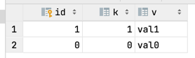

# Задание

**Cassandra**

Необходимо:
- забэкапить и восстановить используя 3DSnap ваш 3 узловый Cassandra кластер;
- выбрать два на ваш вкус драйвера к Cassandra 
  - и сравнить их по производительности и потреблению ресурсов (используя "Apache Cassandra with JPA.pdf" из материралов).

# Отчет

1) Берем официальный образ [тут](https://hub.docker.com/_/cassandra)
2) готовим докер [./docker-compose.yml](docker-compose.yml)
3) Поднимаем 3-x узловой **Cassandra** кластер:
4) ```shell
   NAME                                    COMMAND                  SERVICE             STATUS              PORTS
   cassandra-3nodes-cluster-cassandra1-1   "docker-entrypoint.s…"   cassandra1          running             7000-7001/tcp, 7199/tcp, 9042/tcp, 9160/tcp
   cassandra-3nodes-cluster-cassandra2-1   "docker-entrypoint.s…"   cassandra2          running             7000-7001/tcp, 7199/tcp, 9042/tcp, 9160/tcp
   cassandra-3nodes-cluster-cassandra3-1   "docker-entrypoint.s…"   cassandra3          running             7000-7001/tcp, 7199/tcp, 9042/tcp, 9160/tcp
   ```
5) забэкапить и восстановить используя 3DSnap
   1) создаем набор данных:
   2) ```sql
      system> CREATE KEYSPACE cqlkeyspace
               WITH replication = {'class': 'SimpleStrategy', 'replication_factor' : 3}
   
      USE cqlkeyspace;
   
      CREATE TABLE t (
        id int,
        k int,
        v text,
        PRIMARY KEY (id)
      );
   
      CREATE TABLE t2 (
        id int,
        k int,
        v text,
        PRIMARY KEY (id)
      );
   
      INSERT INTO t (id, k, v) VALUES (0, 0, 'val0');
      INSERT INTO t (id, k, v) VALUES (1, 1, 'val1');
   
      INSERT INTO t2 (id, k, v) VALUES (0, 0, 'val0');
      INSERT INTO t2 (id, k, v) VALUES (1, 1, 'val1');
      INSERT INTO t2 (id, k, v) VALUES (2, 2, 'val2');
      ```
   3) 
   4) 
   5) бекапим данные через `nodetool help snapshot`
   6) `nodetool snapshot --tag cqlkeyspace-ks cqlkeyspace`
   7) ```shell
      # nodetool snapshot --tag cqlkeyspace-ks cqlkeyspace
      Requested creating snapshot(s) for [cqlkeyspace] with snapshot name [cqlkeyspace-ks] and options {skipFlush=false}
      Snapshot directory: cqlkeyspace-ks
      ```
   8) 
6) выбрать два на ваш вкус драйвера к Cassandra
7) f

 