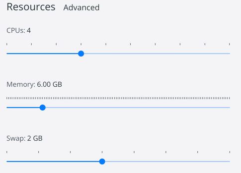

# Задание

**Cassandra**

Необходимо:
- развернуть кластер в облаке или локально (используя "ПРЕРЕКВИЗИТЫ.docx" из материралов);
- поднять 3 узловый Cassandra кластер (используя "How to Run Cassandra on Azure Kubernetes Service (AKS), part1.pdf" из материралов);
- нагрузить кластер при помощи Cassandra Stress Tool (используя "How to use Apache Cassandra Stress Tool.pdf" из материралов).

# Отчет

1) Берем официальный образ [тут](https://hub.docker.com/_/cassandra)
2) готовим докер [./docker-compose.yml](docker-compose.yml)
3) Поднимаем 3-x узловой **Cassandra** кластер:
4) ```shell
   NAME                                    COMMAND                  SERVICE             STATUS              PORTS
   cassandra-3nodes-cluster-cassandra1-1   "docker-entrypoint.s…"   cassandra1          running             7000-7001/tcp, 7199/tcp, 9042/tcp, 9160/tcp
   cassandra-3nodes-cluster-cassandra2-1   "docker-entrypoint.s…"   cassandra2          running             7000-7001/tcp, 7199/tcp, 9042/tcp, 9160/tcp
   cassandra-3nodes-cluster-cassandra3-1   "docker-entrypoint.s…"   cassandra3          running             7000-7001/tcp, 7199/tcp, 9042/tcp, 9160/tcp
   ```
5) нагрузить кластер при помощи **Cassandra Stress Tool**:
6) при следующих выделяемых ресурсах:
7) 
8) запись 1,000,000 строк в 50 потоков:
   1) `cassandra-stress write n=1000000 -rate threads=50`
   2) ```shell
      Results:
      Op rate                   :   16,479 op/s  [WRITE: 16,479 op/s]
      Partition rate            :   16,479 pk/s  [WRITE: 16,479 pk/s]
      Row rate                  :   16,479 row/s [WRITE: 16,479 row/s]
      Latency mean              :    3.0 ms [WRITE: 3.0 ms]
      Latency median            :    0.8 ms [WRITE: 0.8 ms]
      Latency 95th percentile   :    9.9 ms [WRITE: 9.9 ms]
      Latency 99th percentile   :   34.5 ms [WRITE: 34.5 ms]
      Latency 99.9th percentile :   92.4 ms [WRITE: 92.4 ms]
      Latency max               : 7088.4 ms [WRITE: 7,088.4 ms]
      Total partitions          :  1,000,000 [WRITE: 1,000,000]
      Total errors              :          0 [WRITE: 0]
      Total GC count            : 0
      Total GC memory           : 0.000 KiB
      Total GC time             :    0.0 seconds
      Avg GC time               :    NaN ms
      StdDev GC time            :    0.0 ms
      Total operation time      : 00:01:00
   
      END
      ```
9) чтение 200 тыс. строк в 50 потоков:
   1) `cassandra-stress read n=200000 -rate threads=50`
   2) ```shell
      Results:
      Op rate                   :   23,712 op/s  [READ: 23,712 op/s]
      Partition rate            :   23,712 pk/s  [READ: 23,712 pk/s]
      Row rate                  :   23,712 row/s [READ: 23,712 row/s]
      Latency mean              :    1.9 ms [READ: 1.9 ms]
      Latency median            :    1.1 ms [READ: 1.1 ms]
      Latency 95th percentile   :    5.5 ms [READ: 5.5 ms]
      Latency 99th percentile   :   15.0 ms [READ: 15.0 ms]
      Latency 99.9th percentile :   46.3 ms [READ: 46.3 ms]
      Latency max               :  116.4 ms [READ: 116.4 ms]
      Total partitions          :    200,000 [READ: 200,000]
      Total errors              :          0 [READ: 0]
      Total GC count            : 0
      Total GC memory           : 0.000 KiB
      Total GC time             :    0.0 seconds
      Avg GC time               :    NaN ms
      StdDev GC time            :    0.0 ms
      Total operation time      : 00:00:08
    
      END
      ```
10) чтение 200 тыс. строк (без warm up): 
    1) `cassandra-stress read n=200000 no-warmup -rate threads=50`
    2) ```shell
       Results:
       Op rate                   :   21,425 op/s  [READ: 21,425 op/s]
       Partition rate            :   21,425 pk/s  [READ: 21,425 pk/s]
       Row rate                  :   21,425 row/s [READ: 21,425 row/s]
       Latency mean              :    2.2 ms [READ: 2.2 ms]
       Latency median            :    1.2 ms [READ: 1.2 ms]
       Latency 95th percentile   :    6.8 ms [READ: 6.8 ms]
       Latency 99th percentile   :   17.0 ms [READ: 17.0 ms]
       Latency 99.9th percentile :   46.7 ms [READ: 46.7 ms]
       Latency max               :  151.1 ms [READ: 151.1 ms]
       Total partitions          :    200,000 [READ: 200,000]
       Total errors              :          0 [READ: 0]
       Total GC count            : 0
       Total GC memory           : 0.000 KiB
       Total GC time             :    0.0 seconds
       Avg GC time               :    NaN ms
       StdDev GC time            :    0.0 ms
       Total operation time      : 00:00:09
    
       END
       ```
11) чтение в течение 3 минут
    1) `cassandra-stress read duration=3m -rate threads=50`:
       1) ```shell
          Results:
          Op rate                   :   35,473 op/s  [READ: 35,473 op/s]
          Partition rate            :   35,473 pk/s  [READ: 35,473 pk/s]
          Row rate                  :   35,473 row/s [READ: 35,473 row/s]
          Latency mean              :    1.4 ms [READ: 1.4 ms]
          Latency median            :    0.9 ms [READ: 0.9 ms]
          Latency 95th percentile   :    3.7 ms [READ: 3.7 ms]
          Latency 99th percentile   :    8.5 ms [READ: 8.5 ms]
          Latency 99.9th percentile :   19.3 ms [READ: 19.3 ms]
          Latency max               :  132.5 ms [READ: 132.5 ms]
          Total partitions          :  6,396,535 [READ: 6,396,535]
          Total errors              :          0 [READ: 0]
          Total GC count            : 0
          Total GC memory           : 0.000 KiB
          Total GC time             :    0.0 seconds
          Avg GC time               :    NaN ms
          StdDev GC time            :    0.0 ms
          Total operation time      : 00:03:00
       
          END
          ```

 