# Задание

Развернуть кластер Couchbase
Создать БД, наполнить небольшими тестовыми данными
Проверить отказоустойчивость

# Отчет

1) берем образ [тут](https://hub.docker.com/r/couchbase/server)
2) создаем [./docker-compose.yml](docker-compose.yml)
3) запускаем `docker compose up -d`
4) проверяем что все контейнеры подняты `docker compose ps`
   1) ```shell
      NAME                     COMMAND                  SERVICE             STATUS              PORTS
      couchbase_couchbase1_1   "/entrypoint.sh couc…"   couchbase1          running             18091-18096/tcp
      couchbase_couchbase2_1   "/entrypoint.sh couc…"   couchbase2          running             18091-18096/tcp
      couchbase_couchbase3_1   "/entrypoint.sh couc…"   couchbase3          running             0.0.0.0:8091-8093->8091-8093/tcp, 0.0.0.0:11210->11210/tcp
      ```
5) заходим в веб-консоль [http://localhost:8091/](http://localhost:8091/)
6) видим следующую форму
   1) 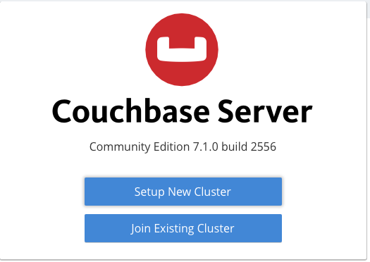
7) нажимаем **"Setup New Cluster"**
   1) водим название кластера `otus`
   2) водим user `admin`
   3) водим пароль `DfkjSA`
8) видим форму с ресурсами: 
   1) 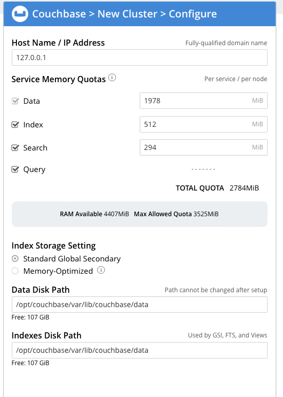
9) после создания кластера, добавляем оставшиеся ноды и делаем ребалансировку кластера:
   1) 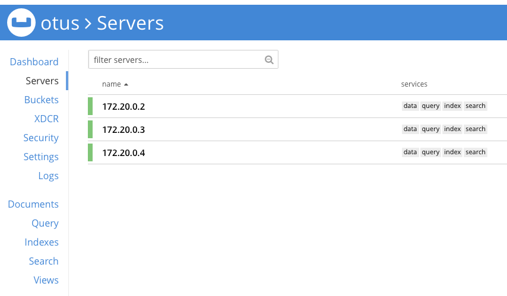
10) создаем БД и наполняем тестовыми данными
    1)  
    2) 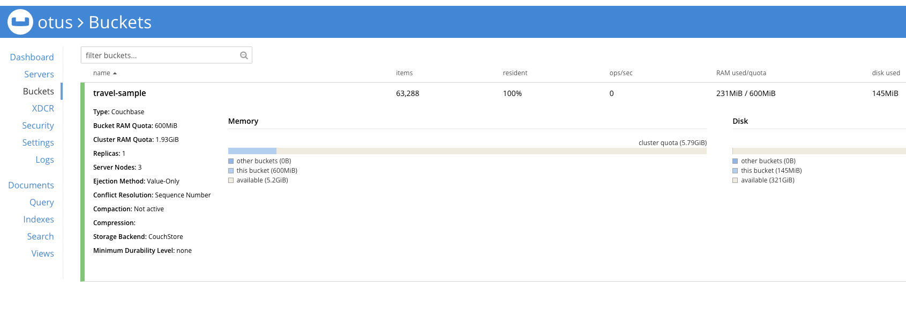 
    3) 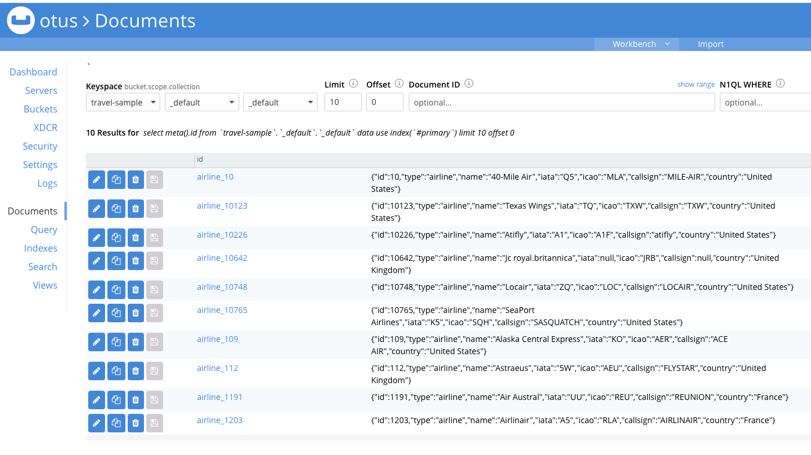 
    4) 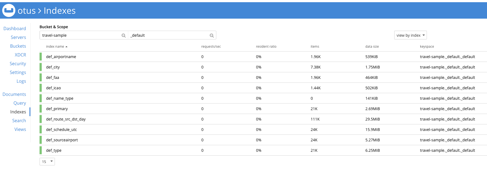 
    5) 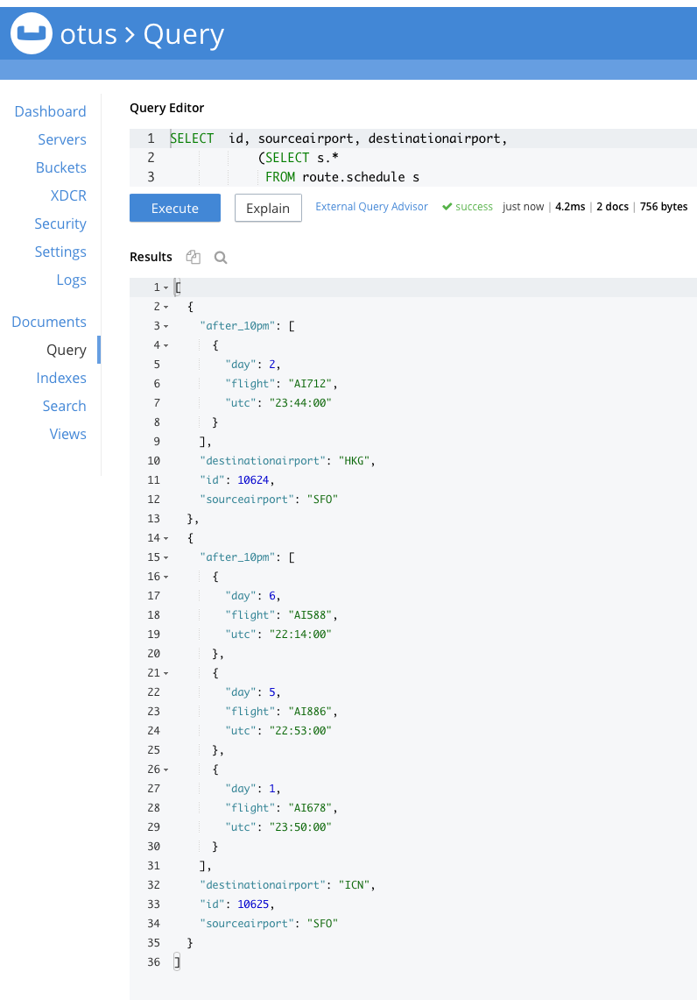
11) выведем из строя первую ноду `docker compose stop couchbase1`
    1) ```shell
       NAME                     COMMAND                  SERVICE             STATUS              PORTS
       couchbase-couchbase1-1   "/entrypoint.sh couc…"   couchbase1          exited (0)          
       couchbase-couchbase2-1   "/entrypoint.sh couc…"   couchbase2          running             18091-18096/tcp
       couchbase-couchbase3-1   "/entrypoint.sh couc…"   couchbase3          running             0.0.0.0:8091-8093->8091-8093/tcp, 0.0.0.0:11210->11210/tcp
       ```
    2) 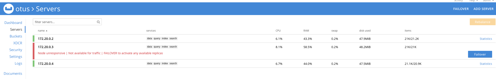
12) делаем failover
    1) 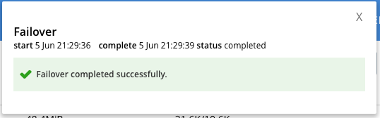
13) все продолжает работать
14) запускаем ноду обратно `docker compose start couchbase1`
15) нода находится в состоянии failed-over 
    1) 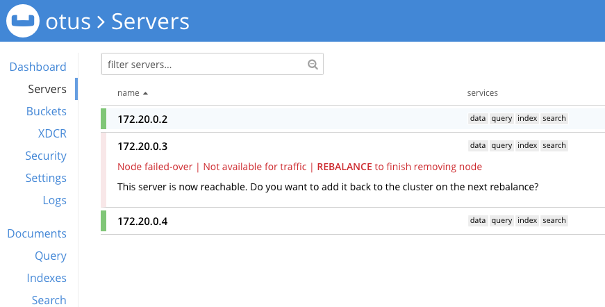
16) вводим в строй и делаем ребалансировку кластера
    1) 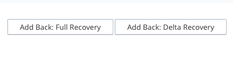 
    2) 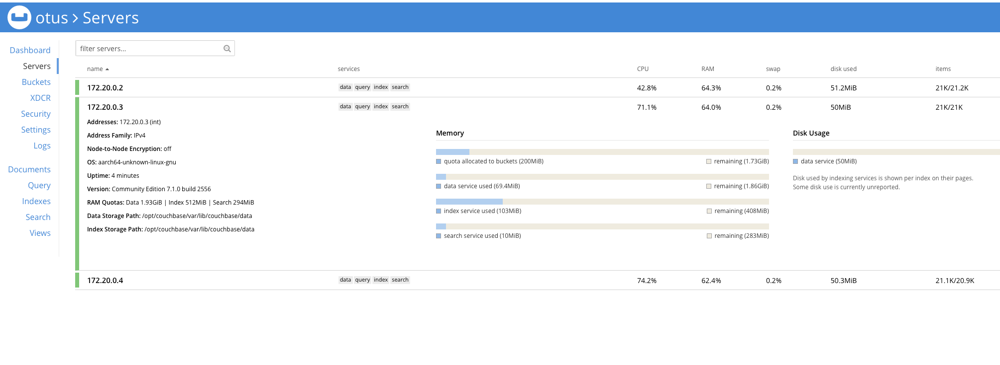
17) все продолжает работать в штатном режиме