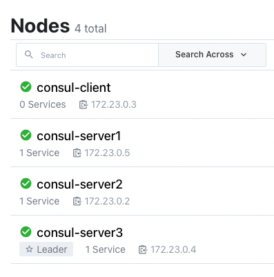
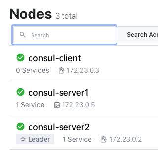
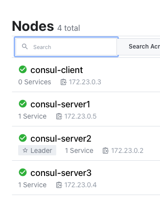
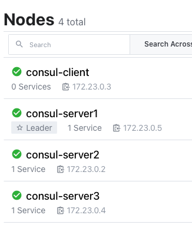

# Задание

Развернуть отказоустойчивый DCS

**Необходимо**:
- Разворачиваем кластер Consul любым способом. Проверяем отказоустойчивость

# Отчет

1) Берем официальный образ c [hub.docker.com](https://hub.docker.com/r/hashicorp/consul)
2) **Разворачиваем локальный кластер Consul**
   1) готовим докер [./docker-compose.yml](docker-compose.yml) по принципу https://github.com/hashicorp/learn-consul-docker/tree/main/datacenter-deploy-secure
   2) убеждаемся что поднялся и выбран лидер
   3) [http://localhost:8500/ui/dc1/nodes](http://localhost:8500/ui/dc1/nodes)
   4) 
   5) или 
      1) `docker compose exec consul-client consul members`
         1) ```shell
            Node            Address          Status  Type    Build   Protocol  DC   Partition  Segment
            consul-server1  172.23.0.5:8301  alive   server  1.11.2  2         dc1  default    <all>
            consul-server2  172.23.0.2:8301  alive   server  1.11.2  2         dc1  default    <all>
            consul-server3  172.23.0.4:8301  alive   server  1.11.2  2         dc1  default    <all>
            consul-client   172.23.0.3:8301  alive   client  1.11.2  2         dc1  default    <default>
            ```
3) **Проверяем отказоустойчивость**
   1) роняем `consul-server3` (лидера)
      1) лидер переизбирается по алгоритму [RAFT](https://raft.github.io)
      2) 
      3) поднимаем `consul-server3`
      4) 
      5) `consul-server3` стал фолловером
   2) роняем `consul-server2` и `consul-server3`
      1) `docker compose exec consul-client consul members`
      2) ```shell
         Node            Address          Status  Type    Build   Protocol  DC   Partition  Segment
         consul-server1  172.23.0.5:8301  alive   server  1.11.2  2         dc1  default    <all>
         consul-server2  172.23.0.2:8301  failed  server  1.11.2  2         dc1  default    <all>
         consul-server3  172.23.0.4:8301  left    server  1.11.2  2         dc1  default    <all>
         consul-client   172.23.0.3:8301  alive   client  1.11.2  2         dc1  default    <default>
         ```
      3) наш кластер развалился и лидер не может быть выбран
      4) ```shell
         2022-07-19T12:48:50.890Z [WARN]  agent.server.raft: Election timeout reached, restarting election
         2022-07-19T12:48:50.891Z [INFO]  agent.server.raft: entering candidate state: node="Node at 172.23.0.5:8300 [Candidate]" term=45
         2022-07-19T12:48:50.917Z [WARN]  agent.server.raft: unable to get address for server, using fallback address: id=4c8a38ed-cd07-4574-cde4-0d3c9aaf2fb6 fallback=172.23.0.2:8300 error="Could not find address for server id 4c8a38ed-cd07-4574-cde4-0d3c9aaf2fb6"
         2022-07-19T12:48:54.027Z [ERROR] agent.server.raft: failed to make requestVote RPC: target="{Voter 4c8a38ed-cd07-4574-cde4-0d3c9aaf2fb6 172.23.0.2:8300}" error="dial tcp <nil>->172.23.0.2:8300: connect: no route to host"
         ```
      5) поднимаем `consul-server2` и `consul-server3` 
         1) 
 