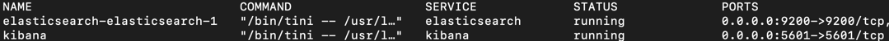
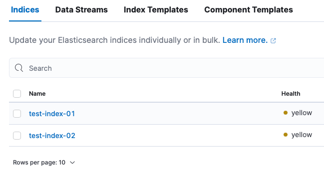
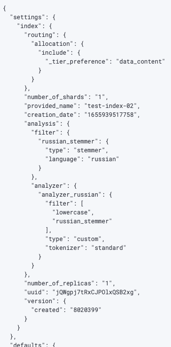

# Задание

* Развернуть Instance ES – желательно в AWS
* Создать в ES индекс, в нём должно быть обязательное поле text типа string
* Создать для индекса pattern
* Добавить в индекс как минимум 3 документа желательно со следующим содержанием:
  * «моя мама мыла посуду а кот жевал сосиски»
  * «рама была отмыта и вылизана котом»
  * «мама мыла раму»
* Написать запрос нечеткого поиска к этой коллекции документов ко ключу «мама ела сосиски»
* Расшарить коллекцию postman (желательно сдавать в таком формате)
* Прислать ссылку на коллекцию

# Отчет

1) Берем официальный образ [https://hub.docker.com/_/elasticsearch](https://hub.docker.com/_/elasticsearch)
2) для удобства добавим Кибану [https://hub.docker.com/_/kibana](https://hub.docker.com/_/kibana)
3) создаем [./docker-compose.yml](docker-compose.yml)
4) запускаем 
5) заходим в Кибану по порту 5601: [http://localhost:5601/](http://localhost:5601/)
6) Создать в ES индекс, в нём должно быть обязательное поле `text` типа string:
   1) ```json lines
      PUT /test-index-01
      {
         "settings": {
            "analysis": {
                "filter": {
                  "russian_stemmer": {
                    "type": "stemmer",
                    "language": "russian"
                  }
                },
                "analyzer": {
                  "analyzer_russian": {
                    "type": "custom",
                    "tokenizer": "standard",
                    "filter": [
                       "lowercase",
                       "russian_stemmer"
                    ]
                  }
                }
            }
         },
         "mappings": {
            "properties": {
               "text": {
                  "type": "text",
                  "index": "true",
                  "search_analyzer": "analyzer_russian",
                  "analyzer": "analyzer_russian"
               }
            }
         }
      }
      ```
   2) ```json lines
      {
          "shards_acknowledged" : true,
          "index" : "test-index-01",
          "acknowledged" : true,
      }
      ```
7) Создать для индекса pattern:
   1) создаем компонент `test-index-component`:
      - ```json lines
          PUT _component_template/test-index-component
          {
             "template": {
                "settings": {
                    "analysis": {
                       "filter": {
                         "russian_stemmer": {
                           "type": "stemmer",
                           "language": "russian"
                         }
                       },
                       "analyzer": {
                          "analyzer_russian": {
                            "type": "custom",
                            "tokenizer": "standard",
                            "filter": [
                               "lowercase",
                               "russian_stemmer"
                            ]
                          }
                       }
                    }
                },
                "mappings": {
                   "dynamic_templates": [],
                   "properties": {
                     "text": {
                        "type": "text",
                        "index": true,
                        "analyzer": "analyzer_russian",
                        "search_analyzer": "analyzer_russian",
                        "eager_global_ordinals": false,
                        "index_phrases": false,
                        "norms": true,
                        "fielddata": false,
                        "store": false,
                        "index_options": "positions"
                     }
                   }
                }
             }
          }
         ```
      - создаем шаблон на основе компонента `test-index-component`:
         - ```json lines
            PUT _index_template/test-index-template
            {
               "index_patterns": [
                 "test-index-*"
               ],
               "composed_of": [
                 "test-index-component"
               ]
            }
            
            {
               "acknowledged" : true
            }
            ```
      - можно создавать индексы содержащие паттерн `test-index-*` по ранее созданному шаблону `test-index-template`:
         - ```json lines
            PUT /test-index-02
            
            {
               "acknowledged" : true,
               "shards_acknowledged" : true,
               "index" : "test-index-02"
            }
            ```
         - 
         - 
8) Добавить в индекс, как минимум 3 документа, желательно со следующим содержанием:
   1) _«моя мама мыла посуду а кот жевал сосиски»_
      1) ```json lines
         POST /test-index-01/_doc
         { "text" : "моя мама мыла посуду а кот жевал сосиски"}
         ```
   2) _«рама была отмыта и вылизана котом»_
      1) ```json lines
         POST /test-index-01/_doc
         { "text" : "рама была отмыта и вылизана котом"}
         ```
   3) _«мама мыла раму»_
      1) ```json lines
         POST /test-index-01/_doc
         { "text" : "мама мыла раму"}
         ```
      2) проверяем:
         1) ```json lines
            GET /test-index-01/_search
            {
              "query": {
                 "match_all": {}
              }
            }
            ```
         2) ```json lines
            {
               "took" : 307,
               "timed_out" : false,
               "_shards" : {
                  "total" : 1,
                  "successful" : 1,
                  "skipped" : 0,
                  "failed" : 0
               },
               "hits" : {
                 "total" : {
                 "value" : 3,
                 "relation" : "eq"
               },
               "max_score" : 1.0,
               "hits" : [
                   {
                      "_index" : "test-index-01",
                      "_id" : "IYF5jYEBT3CDB1EWPbfb",
                      "_score" : 1.0,
                      "_source" : {
                        "text" : "моя мама мыла посуду а кот жевал сосиски"
                      }
                   },
                   {
                     "_index" : "test-index-01",
                     "_id" : "IoF5jYEBT3CDB1EWWLdG",
                     "_score" : 1.0,
                     "_source" : {
                       "text" : "рама была отмыта и вылизана котом"
                     }
                   },
                   {
                     "_index" : "test-index-01",
                     "_id" : "I4F5jYEBT3CDB1EWZLeT",
                     "_score" : 1.0,
                     "_source" : {
                       "text" : "мама мыла раму"
                     }
                   }
               ]
               }
            }
            ```
9) Написать запрос нечеткого поиска к этой коллекции документов ко ключу _«мама ела сосиски»_:
   1) ```json lines
       GET /test-index-01/_search
       {
         "query": {
           "match": {
             "text": {
               "query": "мама ела сосиски",
               "fuzziness": "auto"
             }
           }
         }
       }
      ```
   2) ```json lines
      {
        "took" : 4,
        "timed_out" : false,
        "_shards" : {
           "total" : 1,
           "successful" : 1,
           "skipped" : 0,
           "failed" : 0
        },
        "hits" : {
          "total" : {
            "value" : 3,
            "relation" : "eq"
          },
          "max_score" : 1.241674,
          "hits" : [
              {
                "_index" : "test-index-01",
                "_id" : "IYF5jYEBT3CDB1EWPbfb",
                "_score" : 1.241674,
                "_source" : {
                  "text" : "моя мама мыла посуду а кот жевал сосиски"
                }
              },
              {
                "_index" : "test-index-01",
                "_id" : "I4F5jYEBT3CDB1EWZLeT",
                "_score" : 0.97009575,
                "_source" : {
                  "text" : "мама мыла раму"
                }
              },
              {
                "_index" : "test-index-01",
                "_id" : "IoF5jYEBT3CDB1EWWLdG",
                "_score" : 0.30597273,
                "_source" : {
                   "text" : "рама была отмыта и вылизана котом"
                }
              }
          ]
        }
      }
      ```
 